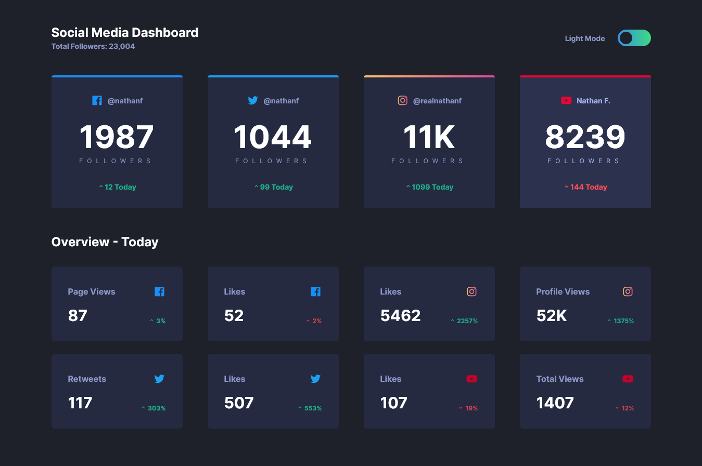
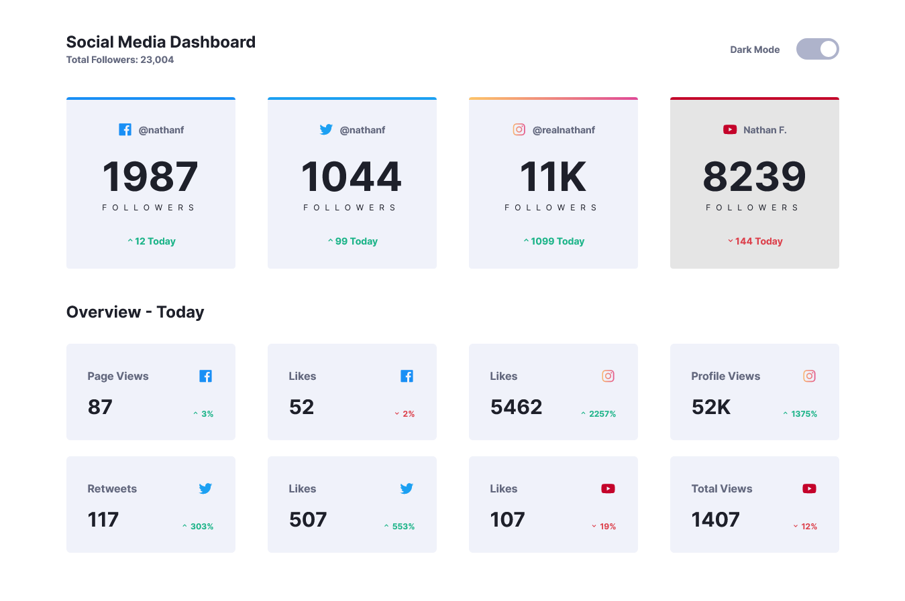

# Frontend Mentor - Social Media Dashboard with theme switcher solution

This is a solution to the [Social Media Dashboard with Theme Switcher Challenge on Frontend Mentor](https://www.frontendmentor.io/challenges/social-media-dashboard-with-theme-switcher-6oY8ozp_H). Frontend Mentor challenges help you improve your coding skills by building realistic projects.

## Table of contents

- [Frontend Mentor - Social Media Dashboard with theme switcher solution](#frontend-mentor---social-media-dashboard-with-theme-switcher-solution)
  - [Table of contents](#table-of-contents)
  - [Overview](#overview)
    - [The challenge](#the-challenge)
    - [Screenshot](#screenshot)
    - [Links](#links)
  - [My process](#my-process)
    - [Built with](#built-with)
  - [Author](#author)

## Overview

### The challenge

Users should be able to:

- View the optimal layout for the site depending on their device's screen size
- See hover states for all interactive elements on the page
- Toggle color theme to their preference

### Screenshot

### Links

- Solution URL: [Right here!](https://www.frontendmentor.io/solutions/social-media-dashboard-with-svelte-typescript-and-windicss-Hya2kDX49)
- Live Site URL: [Deployed on Vercel](https://social-media-dashboard-khaki-xi.vercel.app/)

## My process

### Built with

- Semantic HTML5 markup
- Svelte
- TypeScript
- WindiCSS [Grid + Flexbox]
- Mobile-first workflow
- Vite

## Author

- Frontend Mentor - [@Shawn Lee](https://www.frontendmentor.io/profile/OGShawnLee)
